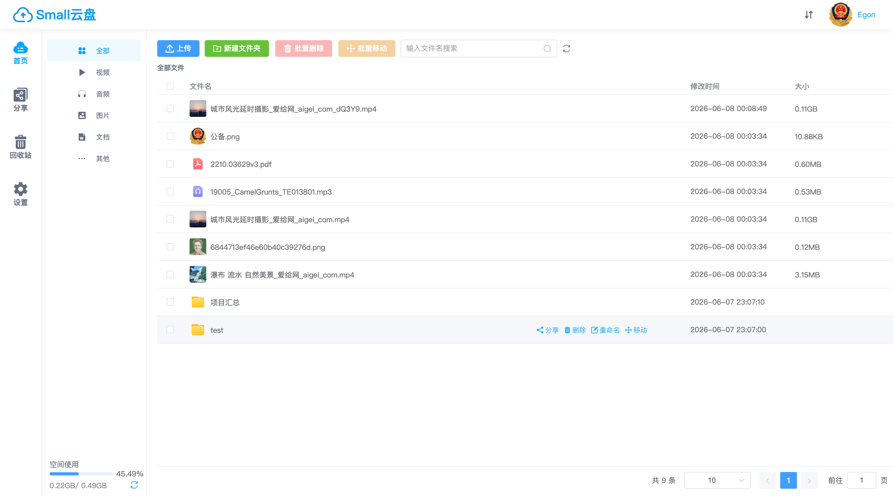
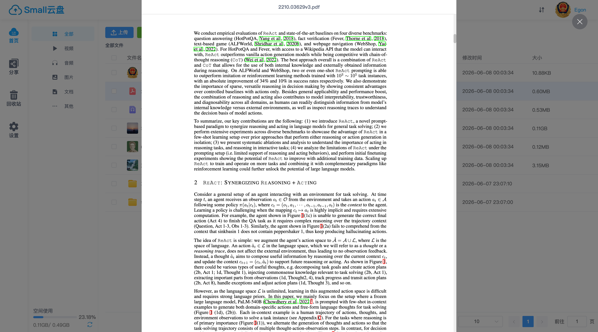
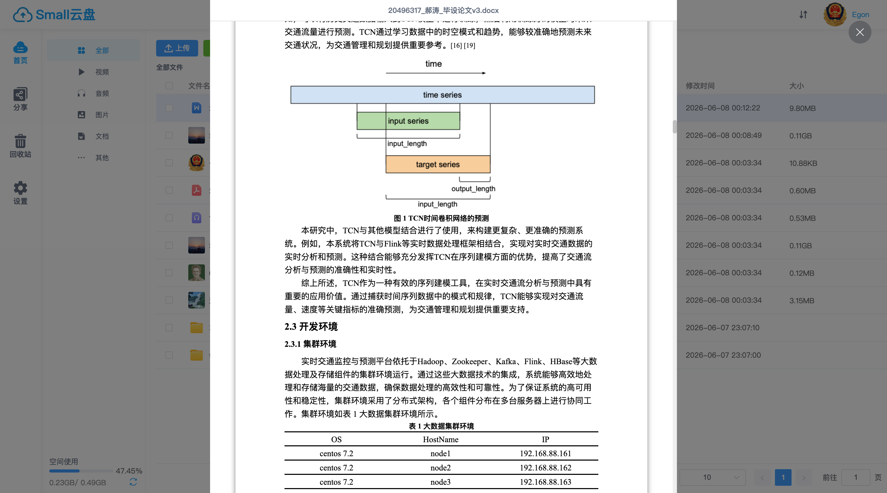
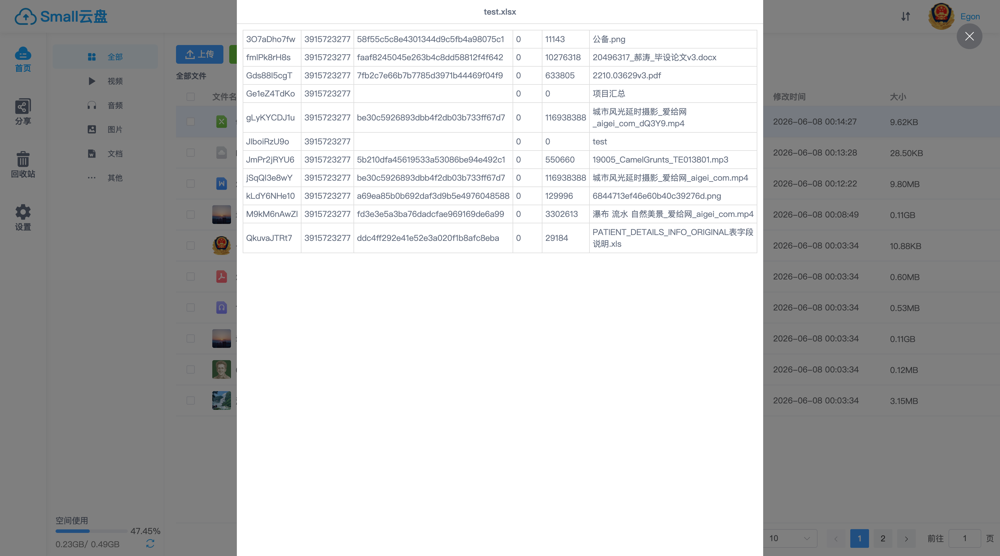
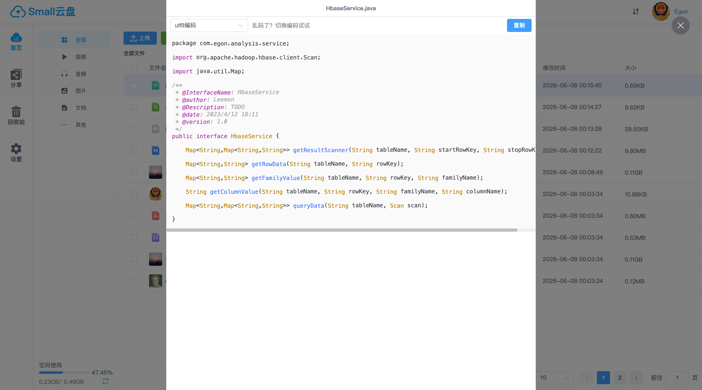
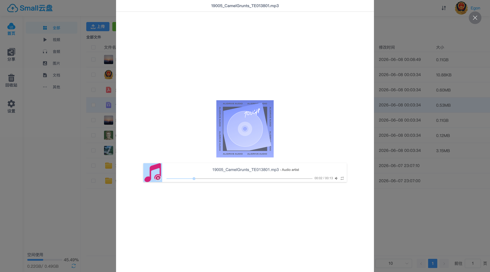
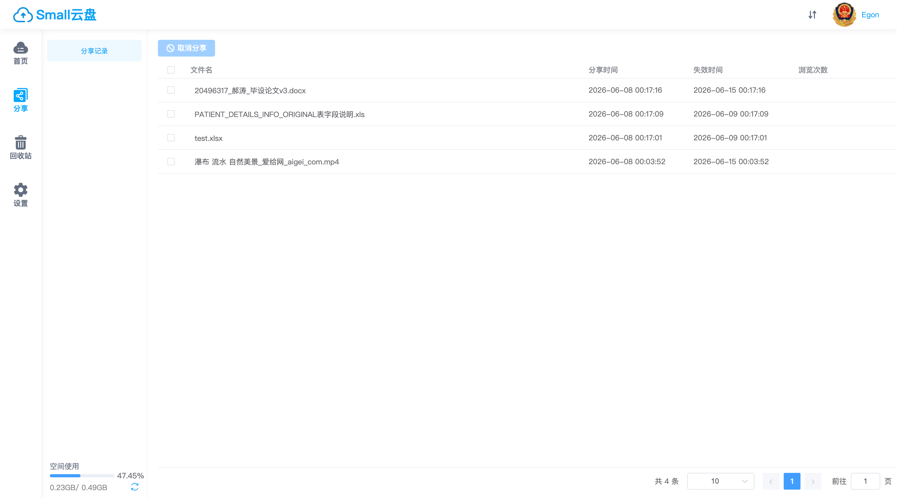
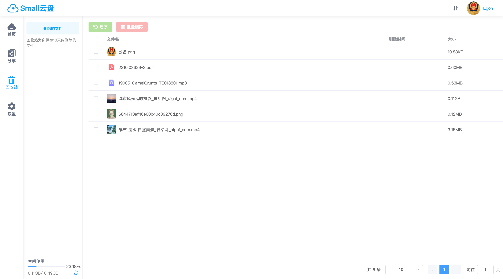
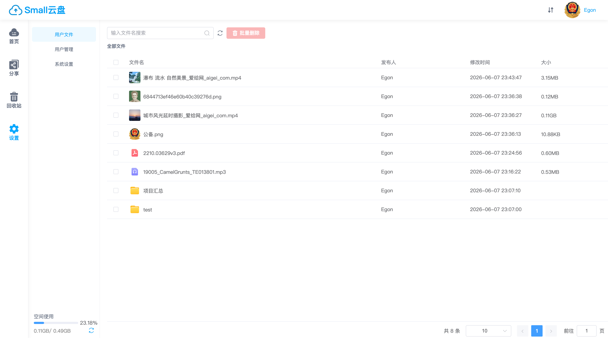

# EasyPan — 轻量级私有云盘

<div align="center">


**轻量级网盘 · 文件管理 · 分片秒传 · 多格式预览 · 分享下载 · 回收站 · 管理后台**

</div>

---

## 📖 项目简介

EasyPan 是一个**前后端分离的轻量级私有云盘系统**，提供完整的文件生命周期管理。支持大文件**分片上传**、**MD5 秒传**、**视频 M3U8 流式播放**、Office 文档在线预览、文件分享与回收站等高级特性。适用于个人网盘、团队文件共享、企业内部文档管理等场景。

### 核心特性

- **🗂️ 文件管理** — 上传/下载、新建文件夹、重命名、移动、批量操作、面包屑导航、文件名搜索
- **⚡ 分片上传 & 秒传** — 大文件分片并发上传，SparkMD5 秒传判定，实时进度展示
- **🎬 多格式预览** — 视频(M3U8/HLS)、图片、PDF、Word、Excel、代码高亮、音乐播放
- **🔗 文件分享** — 生成分享链接，支持提取码、有效期（1天/7天/30天/永久），可保存到自己的网盘
- **🗑️ 回收站** — 软删除机制，支持恢复和彻底删除
- **👤 用户系统** — 邮箱注册/登录、QQ 互联登录、头像上传、密码重置、图片验证码
- **👑 管理后台** — 用户管理、空间配额、系统设置、用户文件查看

---

## 🏗️ 系统架构

```
┌─────────────────────────────────────────────────────────┐
│                     easypan-front                       │
│                  Vue 3 + Vite + Element Plus             │
│                      Port: 1024                         │
└────────────────────────┬────────────────────────────────┘
                         │ /api (proxy)
                         ▼
┌─────────────────────────────────────────────────────────┐
│                      easypan                            │
│                Spring Boot 2.6.1 + Java 8                │
│                      Port: 7090                         │
│  ┌──────────┐  ┌──────────┐  ┌──────────┐              │
│  │  AOP 鉴权 │  │ Service  │  │ MapStruct│              │
│  │ @Global   │  │   业务层  │  │  PO↔VO  │              │
│  │Interceptor│  │          │  │  映射    │              │
│  └──────────┘  └──────────┘  └──────────┘              │
└──────┬──────────────┬──────────────┬────────────────────┘
       │              │              │
       ▼              ▼              ▼
┌──────────┐  ┌──────────┐  ┌──────────────┐
│  MySQL   │  │  Redis   │  │  本地磁盘     │
│ 持久化存储 │  │ 缓存/会话 │  │  文件存储     │
└──────────┘  └──────────┘  └──────────────┘
```

---

## 📁 项目结构

```
SmallPan/
├── easypan/                    # 后端 Spring Boot 项目
│   ├── README.md               # 后端详细文档
│   ├── pom.xml
│   └── src/
│       ├── main/java/com/easypan/
│       │   ├── controller/     # REST 控制器
│       │   ├── service/        # 业务逻辑层
│       │   ├── mappers/        # MyBatis Plus DAO
│       │   ├── entity/         # PO / VO / DTO / Enum
│       │   ├── convert/        # MapStruct 对象转换
│       │   ├── annotation/     # @GlobalInterceptor / @VerifyParam
│       │   ├── aspect/         # AOP 切面实现
│       │   ├── config/         # Spring 配置
│       │   ├── exception/      # 全局异常处理
│       │   ├── query/          # 查询参数封装
│       │   └── utils/          # 工具类
│       └── resources/
│           ├── application.properties
│           └── com/easypan/mappers/  # MyBatis XML
│
├── easypan-front/              # 前端 Vue 3 项目
│   ├── README.md               # 前端详细文档
│   ├── package.json
│   ├── vite.config.js
│   └── src/
│       ├── views/              # 页面组件
│       │   ├── main/           #   文件管理
│       │   ├── share/          #   我的分享
│       │   ├── recycle/        #   回收站
│       │   ├── webshare/       #   公开分享
│       │   └── admin/          #   管理后台
│       ├── components/         # 通用组件
│       │   └── preview/        #   文件预览器
│       ├── router/             # 路由配置
│       ├── stores/             # Pinia 状态管理
│       └── utils/              # 工具函数
│
└── README.md                   # 本文件
```

---

## 🚀 快速开始

### 环境要求

| 依赖 | 版本 | 说明 |
|------|------|------|
| JDK | 1.8+ | 后端运行环境 |
| Maven | 3.6+ | 后端构建工具 |
| Node.js | 16+ | 前端运行环境 |
| MySQL | 8.0+ | 持久化存储 |
| Redis | 6.x+ | 缓存与会话 |
| FFmpeg | — | 视频转码（可选） |

### 1. 克隆项目

```bash
git clone https://github.com/yourname/SmallPan.git
cd SmallPan
```

### 2. 启动后端

```bash
cd easypan

# 初始化数据库（执行 DDL 脚本，详见 easypan/README.md）

# 修改 src/main/resources/application.properties 中的数据库、Redis、邮件配置

mvn clean package -DskipTests
java -jar target/easypan-1.0.jar
```

后端启动后访问 `http://localhost:7090/api`。

### 3. 启动前端

```bash
cd easypan-front

npm install
npm run dev
```

前端启动后访问 `http://localhost:1024`，开发服务器自动将 `/api` 请求代理到后端。

---

## 📚 详细文档

| 文档 | 说明 |
|------|------|
| [📂 easypan/README.md](easypan/README.md) | 后端架构设计、数据库 DDL、技术亮点、API 说明 |
| [🎨 easypan-front/README.md](easypan-front/README.md) | 前端组件架构、路由设计、预览器调度、部署配置 |

---

## 🔥 技术亮点

### 后端

- **AOP + 注解驱动的声明式鉴权** — `@GlobalInterceptor` 一行注解完成登录校验、管理员校验、参数校验
- **分片上传 + MD5 秒传** — 大文件分片并发上传，已存在文件秒传跳过传输
- **原子化空间管理** — MySQL 行级原子操作保证空间配额不超限
- **视频 M3U8 切片** — FFmpeg 异步转码，HLS 流式播放
- **MapStruct 编译期映射** — PO↔VO 零运行时开销，类型安全
- **Redis 多场景应用** — 验证码、下载令牌、空间缓存、系统设置热更新

### 前端

- **分片上传引擎** — SparkMD5 增量计算 + 分片并发 + 断点续传
- **多格式预览调度器** — 根据文件类型动态选择 7 种预览器，支持 3 种上下文模式
- **Axios 拦截器链** — 统一 Loading、错误处理、超时自动跳转登录
- **全局属性注入** — 通过 Vue globalProperties 注入工具函数，无需重复 import
- **路由守卫 + Cookie 认证** — 未登录自动跳转，登录后回跳原页面

---

## 🖼️ 功能预览

| 功能 | 预览 |
|------|------|
| **文件管理** | 分类导航 + 面包屑 + 网格列表 + 搜索 + 批量操作 |
| **分片上传** | 大文件分片并发上传，MD5 秒传，实时进度条 |
| **多格式预览** | 视频(HLS) / 图片 / PDF / Word / Excel / 代码高亮 / 音乐 |
| **文件分享** | 提取码 + 有效期 + 公开访问 + 保存到自己的网盘 |
| **回收站** | 软删除 + 恢复 + 彻底删除 |
| **管理后台** | 用户管理 + 空间配额 + 系统设置 + 用户文件查看 |

### 📂 文件管理

<div align="center">
  
  <p><em>文件管理主页 — 操作栏 + 面包屑导航 + 网格列表 + 行内操作</em></p>
</div>

### ⚡ 分片上传 & 秒传

<div align="center">
  
  <p><em>大文件分片上传，SparkMD5 秒传，实时进度展示</em></p>
</div>

### 🎬 多格式在线预览

<div align="center">
  <table>
    <tr>
      <td align="center"><br><em>视频 (HLS)</em></td>
      <td align="center"><br><em>图片</em></td>
      <td align="center"><br><em>PDF</em></td>
      <td align="center"><br><em>Word</em></td>
    </tr>
    <tr>
      <td align="center"><br><em>Excel</em></td>
      <td align="center"><br><em>代码高亮</em></td>
      <td align="center"><br><em>音乐播放</em></td>
      <td align="center"></td>
    </tr>
  </table>
  <p><em>支持视频、图片、PDF、Office 文档、代码、音乐等多种格式在线预览</em></p>
</div>

### 🔗 文件分享

<div align="center">
  <table>
    <tr>
      <td align="center"><br><em>创建分享</em></td>
      <td align="center"><br><em>我的分享</em></td>
      <td align="center"><br><em>公开分享页</em></td>
    </tr>
  </table>
  <p><em>支持提取码、有效期设置，分享链接可公开访问和保存</em></p>
</div>

### 🗑️ 回收站

<div align="center">
  
  <p><em>软删除机制，支持恢复和彻底删除</em></p>
</div>

### 👑 管理后台

<div align="center">
  <table>
    <tr>
      <td align="center"><br><em>用户管理</em></td>
      <td align="center"><br><em>系统设置</em></td>
      <td align="center"><br><em>用户文件</em></td>
    </tr>
  </table>
  <p><em>管理员可管理用户、设置系统参数、查看用户文件</em></p>
</div>

---

## 📜 开源协议

本项目基于 [MIT License](LICENSE) 开源。