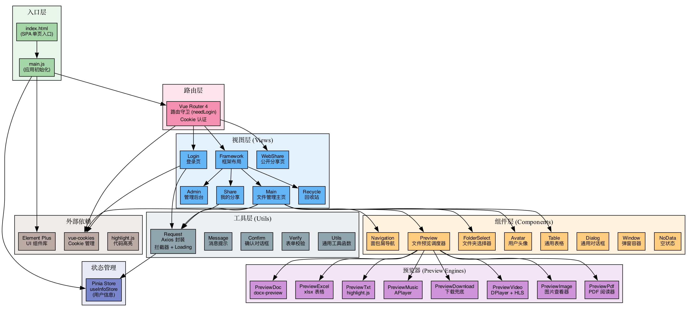

# EasyPan Front — 轻量级云盘前端

<div align="center">


**仿百度网盘界面 · 文件管理 · 在线预览 · 分享下载 · 回收站 · 管理后台**

</div>

---

## 📖 项目简介

EasyPan Front 是 EasyPan 云盘系统的前端单页应用，基于 **Vue 3 + Vite + Element Plus** 构建。实现了完整的网盘交互体验——文件上传、分类浏览、多格式预览、分享链接管理、回收站恢复、管理员后台等功能。支持**大文件分片上传**、**视频 M3U8 流式播放**、**Office 文档在线预览**等高级特性。

### 核心功能

| 模块 | 功能 |
|------|------|
| 🗂️ **文件管理** | 上传/下载、新建文件夹、重命名、移动、批量删除、面包屑导航、文件名搜索 |
| ⚡ **分片上传** | 大文件分片上传 + MD5 秒传，SparkMD5 计算哈希，实时进度展示 |
| 📂 **分类浏览** | 按视频/音频/图片/文档/其他自动分类，全库检索 |
| 🔗 **文件分享** | 生成分享链接，支持提取码、有效期（1天/7天/30天/永久），分享页面可预览和保存到自己网盘 |
| 🗑️ **回收站** | 软删除文件列表，支持恢复和彻底删除，显示删除时间 |
| 👤 **用户系统** | 邮箱注册/登录、QQ 互联登录、头像上传、密码重置、图片验证码 |
| 👑 **管理后台** | 用户管理、系统设置、文件管理（管理员视角） |
| 🎨 **多格式预览** | 视频(M3U8/DPlayer)、图片(Image Viewer)、PDF(pdf-embed)、Office(docx-preview + xlsx)、代码高亮(highlight.js)、音乐(APlayer) |

---

## 🏗️ 技术栈

| 技术 | 版本 | 用途 |
|------|------|------|
| Vue 3 | 3.2.47 | Composition API 响应式框架 |
| Vite | 4.1.4 | 构建工具（HMR 热更新、代理转发） |
| Pinia | 2.0.32 | 状态管理（用户信息） |
| Vue Router | 4.1.6 | SPA 路由 + 导航守卫 |
| Element Plus | 2.2.36 | UI 组件库（表单/表格/对话框/上传） |
| Axios | 1.3.4 | HTTP 请求封装（拦截器 + 全局 Loading） |
| SparkMD5 | 3.0.2 | 文件 MD5 哈希计算（秒传 + 分片校验） |
| DPlayer | 1.27.1 | HLS 视频播放器 |
| HLS.js | 1.1.5 | M3U8 流媒体播放 |
| APlayer | 1.10.1 | 音乐播放器 |
| docx-preview | 0.1.15 | Word 文档在线预览 |
| xlsx | 0.18.5 | Excel 表格预览 |
| vue-pdf-embed | 1.1.5 | PDF 内嵌预览 |
| highlight.js | 11.7.0 | 代码语法高亮 |
| SCSS | 1.59.2 | CSS 预处理器 |

---

## 🧬 系统架构



### 路由设计

```
/login                          # 登录页
/qqlogincalback                 # QQ 登录回调
/                               # 框架布局 (需登录)
  ├── /main/:category           # 文件管理 (all/video/audio/image/doc/other)
  ├── /myshare                  # 我的分享
  ├── /recycle                  # 回收站
  ├── /settings/sysSetting      # 系统设置 (管理员)
  ├── /settings/userList        # 用户管理 (管理员)
  └── /settings/fileList        # 用户文件 (管理员)
/shareCheck/:shareId            # 分享校验 (无需登录)
/share/:shareId                 # 分享浏览 (无需登录)
```

---

## 📁 项目结构

```
easypan-front/
├── index.html                          # HTML 入口
├── vite.config.js                      # Vite 配置（代理/别名/构建分包）
├── package.json                        # 依赖配置
└── src/
    ├── main.js                         # 🔥 应用入口：注册插件、全局组件、全局属性
    ├── App.vue                         # 根组件（Element Plus 国际化配置）
    ├── assets/
    │   ├── base.scss                   # 全局样式
    │   ├── file.list.scss              # 文件列表样式
    │   ├── login_bg.jpg                # 登录页背景
    │   ├── login_img.png               # 登录页插画
    │   ├── qq.png                      # QQ 登录图标
    │   ├── icon/                       # 图标字体文件
    │   └── icon-image/                 # 文件类型图标（PNG）
    │       ├── folder.png, video.png, music.png, image.png
    │       ├── pdf.png, excel.png, ppt1.png, txt.png
    │       ├── code.png, zip.png, file.png, others.png
    │       └── upload.png, del.png, pause.png, clean.png, no_data.png
    ├── router/
    │   └── index.js                    # 路由配置 + 导航守卫（Cookie 认证）
    ├── stores/
    │   └── useInfoStore.js             # Pinia Store：用户信息状态管理
    ├── js/
    │   └── CategoryInfo.js             # 文件分类配置（accept 属性映射）
    ├── utils/
    │   ├── Request.js                  # Axios 封装（拦截器/全局 Loading/错误处理）
    │   ├── Message.js                  # Element Plus 消息提示封装
    │   ├── Confirm.js                  # Element Plus 确认对话框封装
    │   ├── Verify.js                   # 前端表单校验规则
    │   └── Utils.js                    # 通用工具（文件大小格式化、路径处理）
    ├── components/
    │   ├── Avatar.vue                  # 用户头像组件
    │   ├── AvatarUpload.vue            # 头像上传组件
    │   ├── Dialog.vue                  # 通用对话框
    │   ├── FolderSelect.vue            # 文件夹选择器（移动文件时使用）
    │   ├── Icon.vue                    # 文件图标组件（根据文件类型展示对应图标）
    │   ├── Navigation.vue              # 面包屑导航 + 分类标签
    │   ├── NoData.vue                  # 空状态占位组件
    │   ├── Table.vue                   # 通用表格组件（分页/排序/多选）
    │   ├── Window.vue                  # 可拖动弹窗容器
    │   └── preview/
    │       ├── Preview.vue             # 预览调度器（根据文件类型选择预览器）
    │       ├── PreviewVideo.vue        # 视频预览 (DPlayer + HLS/M3U8)
    │       ├── PreviewImage.vue        # 图片预览 (Image Viewer)
    │       ├── PreviewPdf.vue          # PDF 预览 (vue-pdf-embed)
    │       ├── PreviewDoc.vue          # Word 预览 (docx-preview)
    │       ├── PreviewExcel.vue        # Excel 预览 (xlsx)
    │       ├── PreviewTxt.vue          # 文本/代码预览 (highlight.js)
    │       ├── PreviewMusic.vue        # 音乐播放 (APlayer)
    │       └── PreviewDownload.vue     # 下载兜底（不支持预览的文件格式）
    └── views/
        ├── Login.vue                   # 登录页（邮箱/密码 + QQ 登录 + 注册）
        ├── QqLoginCallback.vue         # QQ 登录回调页
        ├── Framework.vue               # 主框架布局（侧边栏 + 顶栏 + 内容区）
        ├── UpdatePassword.vue          # 修改密码页
        ├── UpdateAvatar.vue            # 修改头像页
        ├── main/
        │   ├── Main.vue                # 文件管理核心页（列表/搜索/操作）
        │   ├── Uploader.vue            # 上传器（分片上传 + MD5 秒传）
        │   └── ShareFile.vue           # 创建分享弹窗
        ├── recycle/
        │   └── Recycle.vue             # 回收站页
        ├── share/
        │   └── Share.vue               # 我的分享页
        ├── webshare/
        │   ├── ShareCheck.vue          # 分享校验页（输入提取码）
        │   └── Share.vue               # 公开分享浏览页
        └── admin/
            ├── SysSettings.vue         # 系统设置页
            ├── UserList.vue            # 用户管理页
            └── FileList.vue            # 用户文件管理页
```

---

## 🔥 技术亮点

### 1. 分片上传 + MD5 秒传引擎

文件上传器 `Uploader.vue` 实现了一套完整的分片上传引擎：

- **SparkMD5 增量计算**：使用 SparkMD5 库对文件进行分片哈希计算，边读边算，不阻塞主线程
- **秒传判定**：上传前先发送完整文件 MD5 给后端，后端检查是否已有相同文件，若有则直接返回成功，跳过上传
- **分片并发**：将大文件切分为固定大小的 chunk，并发上传多个分片，充分利用带宽
- **断点续传**：每个分片上传后记录进度，刷新页面后可从已上传的分片继续
- **实时进度**：通过 Axios `onUploadProgress` 回调实时展示上传进度条

### 2. 多格式预览调度器

`Preview.vue` 组件作为预览调度中心，根据文件分类 `fileCategory` 和文件类型 `fileType` 动态选择对应的预览器：

```
fileCategory = 1 (视频) → PreviewVideo  (DPlayer + HLS)
fileCategory = 2 (音频) → PreviewMusic  (APlayer)
fileCategory = 3 (图片) → PreviewImage (Image Viewer)
fileCategory = 4 (文档) → 根据 fileType 细分:
    fileType = 4 (PDF)   → PreviewPdf
    fileType = 5 (Word)  → PreviewDoc
    fileType = 6 (Excel) → PreviewExcel
    fileType = 7/8 (TXT/Code) → PreviewTxt
fileCategory = 5 (其他) → PreviewDownload (下载兜底)
```

支持三种上下文模式（通过 `showPart` 参数控制 API 路径）：
- `0` — 网盘内预览（`/file/`）
- `1` — 管理员预览（`/admin/`）
- `2` — 分享页预览（`/showShare/`）

### 3. Axios 请求拦截器链

`Request.js` 封装了完整的请求拦截器链：

- **请求前**：自动注入 `X-Requested-With` 头，根据 `showLoading` 配置控制全局 Loading 动画
- **响应后**：自动解析 `Result<T>` 包装，`code == 200` 正常返回，`code == 901` 自动跳转登录页，其他错误码触发 `errorCallback` 或全局提示
- **网络异常**：捕获网络异常并统一提示"网络异常"
- **上传进度**：支持 `uploadProgressCallback` 回调，实时传递上传进度

### 4. 全局属性注入模式

工具函数（`Request`、`Message`、`Confirm`、`Verify`、`Utils`）和全局配置（`globalInfo`）通过 `app.config.globalProperties` 注入，在任意组件的 `setup` 中通过 `getCurrentInstance().proxy` 访问，无需重复 import：

```javascript
const { proxy } = getCurrentInstance();
// 直接使用: proxy.Request(...) / proxy.Message.success(...) / proxy.Confirm(...)
```

### 5. 组件化文件图标系统

`Icon.vue` 组件根据文件类型 `fileType` 自动映射对应的图标（`folder.png`、`video.png`、`pdf.png` 等），图片/视频文件还支持封面图展示，实现了网盘类应用的视觉辨识度。

### 6. 路由守卫 + Cookie 认证

Vue Router 的 `beforeEach` 守卫检查 Cookie 中是否存在 `userInfo`，若目标路由标记了 `meta.needLogin = true` 且用户未登录，自动重定向到登录页，并在登录后跳回原目标页面（`redirectUrl` 参数）。

---

## 🚀 快速开始

### 环境要求

- Node.js 16+
- npm 8+

### 1. 安装依赖

```bash
cd easypan-front
npm install
```

### 2. 配置代理

编辑 `vite.config.js`，修改后端代理目标地址：

```javascript
server: {
  port: 1024,
  proxy: {
    "/api": {
      target: "http://YOUR_BACKEND_HOST:7090",  // 修改为你的后端地址
      changeOrigin: true,
    }
  }
}
```

### 3. 启动开发服务器

```bash
npm run dev
```

浏览器访问 `http://localhost:1024`。

### 4. 生产构建

```bash
npm run build
```

构建产物输出到 `dist/` 目录，可直接部署到 Nginx 等静态服务器。构建时自动按 `node_modules` 包名进行 chunk 分包，优化首屏加载性能。

---

## 🖼️ 功能预览

> 请将实际截图放入 `docs/screenshots/` 目录下替换占位图片。

### 📂 文件管理

<div align="center">
  
  <p><em>文件管理主页 — 操作栏 + 面包屑导航 + 网格列表 + 行内操作</em></p>
</div>

### ⚡ 分片上传 & 秒传

<div align="center">
  
  <p><em>大文件分片上传，SparkMD5 秒传，实时进度展示</em></p>
</div>

### 🎬 多格式在线预览

<div align="center">
  <table>
    <tr>
      <td align="center"><br><em>视频 (HLS)</em></td>
      <td align="center"><br><em>图片</em></td>
      <td align="center"><br><em>PDF</em></td>
      <td align="center"><br><em>Word</em></td>
    </tr>
    <tr>
      <td align="center"><br><em>Excel</em></td>
      <td align="center"><br><em>代码高亮</em></td>
      <td align="center"><br><em>音乐播放</em></td>
      <td align="center"></td>
    </tr>
  </table>
  <p><em>支持视频、图片、PDF、Office 文档、代码、音乐等多种格式在线预览</em></p>
</div>

### 🔗 文件分享

<div align="center">
  <table>
    <tr>
      <td align="center"><br><em>创建分享</em></td>
      <td align="center"><br><em>我的分享</em></td>
      <td align="center"><br><em>公开分享页</em></td>
    </tr>
  </table>
  <p><em>支持提取码、有效期设置，分享链接可公开访问和保存</em></p>
</div>

### 🗑️ 回收站

<div align="center">
  
  <p><em>软删除机制，支持恢复和彻底删除</em></p>
</div>

### 👑 管理后台

<div align="center">
  <table>
    <tr>
      <td align="center"><br><em>用户管理</em></td>
      <td align="center"><br><em>系统设置</em></td>
      <td align="center"><br><em>用户文件</em></td>
    </tr>
  </table>
  <p><em>管理员可管理用户、设置系统参数、查看用户文件</em></p>
</div>

---

## 🏷️ Nginx 部署配置参考

```nginx
server {
    listen 80;
    server_name pan.yourdomain.com;

    root /var/www/easypan-front/dist;
    index index.html;

    # SPA 路由回退
    location / {
        try_files $uri $uri/ /index.html;
    }

    # API 反向代理
    location /api/ {
        proxy_pass http://127.0.0.1:7090;
        proxy_set_header Host $host;
        proxy_set_header X-Real-IP $remote_addr;
        proxy_set_header X-Forwarded-For $proxy_add_x_forwarded_for;
    }

    # 静态资源缓存
    location ~* \.(js|css|png|jpg|jpeg|gif|ico|svg|woff|woff2|ttf)$ {
        expires 30d;
        add_header Cache-Control "public, immutable";
    }
}
```

---

## 📜 开源协议

本项目基于 [MIT License](LICENSE) 开源。

---

## 🙏 致谢

- [Vue 3](https://vuejs.org/) — 渐进式 JavaScript 框架
- [Vite](https://vitejs.dev/) — 下一代前端构建工具
- [Element Plus](https://element-plus.org/) — 企业级 Vue 3 组件库
- [DPlayer](https://dplayer.diygod.dev/) — HTML5 弹幕视频播放器
- [APlayer](https://aplayer.js.org/) — HTML5 音乐播放器
- [highlight.js](https://highlightjs.org/) — 代码语法高亮
- [SparkMD5](https://github.com/satazor/js-spark-md5) — 快速 MD5 哈希计算