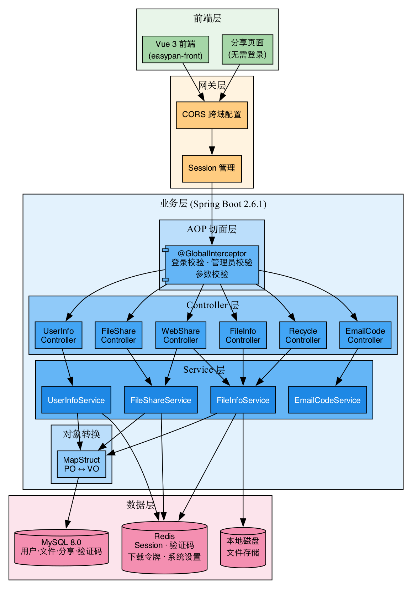
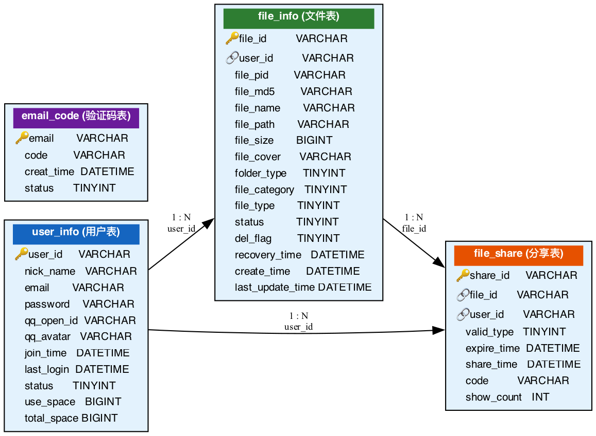
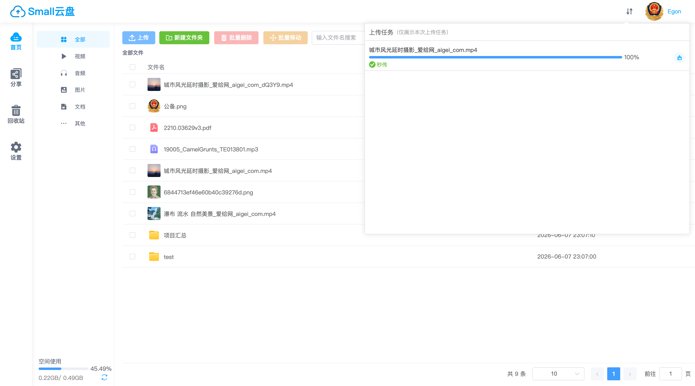
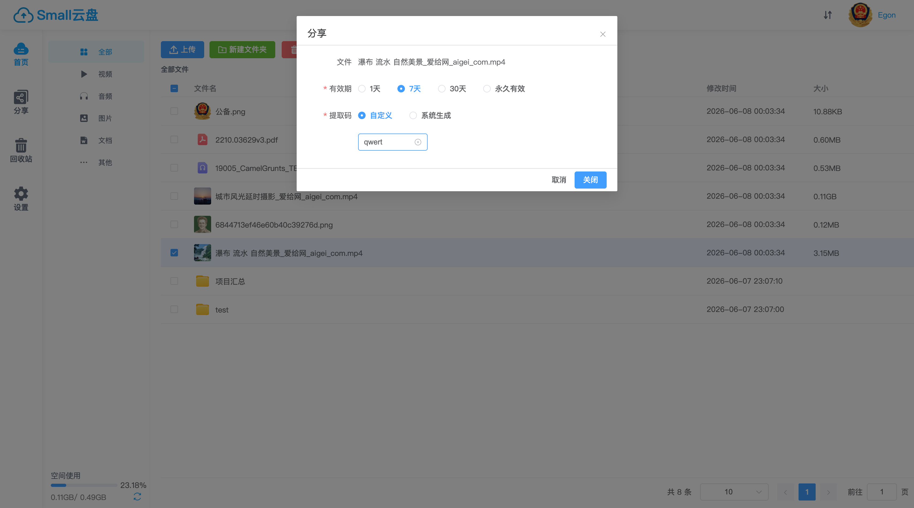
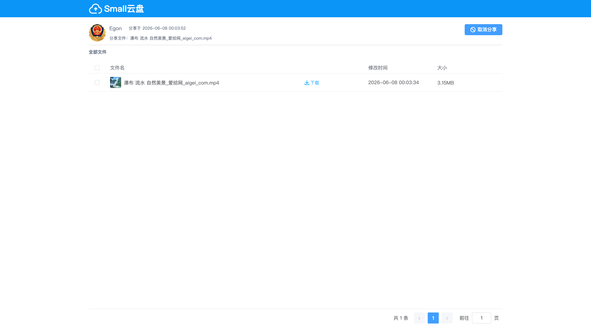
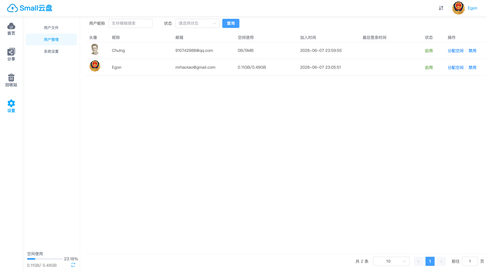

# EasyPan — 轻量级云盘后端

<div align="center">


**一键部署的私有云盘后端服务 · 支持文件管理、秒传、分享、回收站、多格式在线预览**

</div>

---

## 📖 项目简介

EasyPan 是一个**轻量级、高性能的私有云盘系统**后端服务，基于 Spring Boot 2.x 构建。提供完整的文件生命周期管理——上传、分类、预览、分享、回收、恢复。支持大文件**分片上传**、**MD5 秒传**、**视频 M3U8 切片**等高级特性，适用于个人网盘、团队文件共享、企业内部文档管理等场景。

### 核心功能

| 模块 | 功能 |
|------|------|
| 🗂️ **文件管理** | 上传/下载、新建文件夹、重命名、移动、批量删除、面包屑导航 |
| ⚡ **极速上传** | 分片上传 + MD5 秒传，大文件秒级完成 |
| 📂 **分类浏览** | 按视频/音频/图片/文档/其他自动分类，全库检索 |
| 🔗 **文件分享** | 生成分享链接，支持提取码、有效期（1天/7天/30天/永久） |
| 🗑️ **回收站** | 软删除机制，支持恢复和彻底删除 |
| 👤 **用户系统** | 邮箱注册/登录、QQ 互联登录、头像上传、密码重置 |
| 👑 **管理后台** | 用户管理、系统设置、文件管理（管理员视角） |
| 🎨 **多格式预览** | 视频(M3U8)、图片、PDF、Office 文档、代码高亮、音乐播放 |
| 📧 **邮件通知** | QQ 邮箱 SMTP 发送注册验证码、密码重置验证码 |

---

## 🏗️ 技术栈

| 技术 | 版本 | 用途 |
|------|------|------|
| Spring Boot | 2.6.1 | 应用框架 |
| MyBatis Plus | 3.5.1 | ORM + 分页 |
| MySQL | 8.0.23 | 持久化存储 |
| Druid | 1.2.16 | 数据库连接池 |
| Redis | 6.x | 会话缓存 / 验证码 / 下载令牌 |
| AOP (AspectJ) | 1.9.4 | 全局拦截器（认证 + 参数校验） |
| MapStruct | 1.5.2 | 编译期 PO↔VO 对象映射 |
| Lombok | — | 消除样板代码 |
| Hibernate Validator | — | 参数校验 |
| Fastjson | 1.2.66 | JSON 序列化 |
| JavaMail (SMTP) | — | 邮件发送 |

---

## 🧬 系统架构

<div align="center">



</div>

### 请求处理流程

```
客户端请求 → CORS 过滤器 → Session 解析
    → @GlobalInterceptor (AOP 切面)
        ├── checkLogin() → 校验登录态
        ├── checkAdmin() → 校验管理员权限
        └── checkParams() → @VerifyParam 参数校验
    → Controller → Service → Mapper (MyBatis Plus)
    → MySQL / Redis / 本地磁盘
    → MapStruct PO→VO 转换 → Result<T> 统一封装 → JSON 响应
```

---

## 🗄️ 数据库设计

### E-R 图



### DDL

```sql
-- ============================================
-- EasyPan 数据库初始化脚本
-- ============================================

CREATE DATABASE IF NOT EXISTS easypan
    DEFAULT CHARACTER SET utf8mb4
    DEFAULT COLLATE utf8mb4_general_ci;

USE easypan;

-- --------------------------------------------
-- 1. 用户信息表
-- --------------------------------------------
DROP TABLE IF EXISTS `user_info`;
CREATE TABLE `user_info` (
    `user_id`         VARCHAR(32)  NOT NULL COMMENT '用户ID (UUID)',
    `nick_name`       VARCHAR(32)  DEFAULT NULL COMMENT '用户昵称',
    `email`           VARCHAR(150) DEFAULT NULL COMMENT '邮箱 (登录账号)',
    `qq_open_id`      VARCHAR(64)  DEFAULT NULL COMMENT 'QQ 互联 OpenID',
    `qq_avatar`       VARCHAR(512) DEFAULT NULL COMMENT 'QQ 头像 URL',
    `password`        VARCHAR(64)  DEFAULT NULL COMMENT 'MD5 加密密码',
    `join_time`       DATETIME     DEFAULT NULL COMMENT '注册时间',
    `last_login_time` DATETIME     DEFAULT NULL COMMENT '最后登录时间',
    `status`          TINYINT(1)   DEFAULT 1 COMMENT '状态: 0=禁用 1=启用',
    `use_space`       BIGINT(20)   DEFAULT 0 COMMENT '已使用空间 (byte)',
    `total_space`     BIGINT(20)   DEFAULT 0 COMMENT '总空间配额 (byte)',
    PRIMARY KEY (`user_id`),
    UNIQUE KEY `uk_email` (`email`),
    KEY `idx_qq_open_id` (`qq_open_id`)
) ENGINE=InnoDB DEFAULT CHARSET=utf8mb4 COMMENT='用户信息表';

-- --------------------------------------------
-- 2. 文件信息表
-- --------------------------------------------
DROP TABLE IF EXISTS `file_info`;
CREATE TABLE `file_info` (
    `file_id`          VARCHAR(32)  NOT NULL COMMENT '文件ID (UUID)',
    `user_id`          VARCHAR(32)  NOT NULL COMMENT '所属用户ID',
    `file_md5`         VARCHAR(64)  DEFAULT NULL COMMENT '文件 MD5 值 (秒传依据)',
    `file_pid`         VARCHAR(32)  DEFAULT '0' COMMENT '父级目录ID (0=根目录)',
    `file_size`        BIGINT(20)   DEFAULT 0 COMMENT '文件大小 (byte)',
    `file_name`        VARCHAR(256) DEFAULT NULL COMMENT '文件/文件夹名称',
    `file_cover`       VARCHAR(512) DEFAULT NULL COMMENT '文件封面 (视频/音乐)',
    `file_path`        VARCHAR(512) DEFAULT NULL COMMENT '文件存储路径',
    `create_time`      DATETIME     DEFAULT NULL COMMENT '创建时间',
    `last_update_time` DATETIME     DEFAULT NULL COMMENT '最后更新时间',
    `folder_type`      TINYINT(1)   DEFAULT 0 COMMENT '类型: 0=文件 1=文件夹',
    `file_category`    TINYINT(1)   DEFAULT 5 COMMENT '分类: 1=视频 2=音频 3=图片 4=文档 5=其他',
    `file_type`        TINYINT(1)   DEFAULT 10 COMMENT '类型: 1=视频 2=音频 3=图片 4=pdf 5=doc 6=excel 7=txt 8=code 9=zip 10=其他',
    `status`           TINYINT(1)   DEFAULT 2 COMMENT '转码状态: 0=转码中 1=失败 2=成功',
    `recovery_time`    DATETIME     DEFAULT NULL COMMENT '进入回收站时间',
    `del_flag`         TINYINT(1)   DEFAULT 2 COMMENT '删除标记: 0=已删除 1=回收站 2=正常',
    PRIMARY KEY (`file_id`),
    KEY `idx_user_id` (`user_id`),
    KEY `idx_file_pid` (`file_pid`),
    KEY `idx_md5` (`file_md5`),
    KEY `idx_del_flag` (`del_flag`)
) ENGINE=InnoDB DEFAULT CHARSET=utf8mb4 COMMENT='文件信息表';

-- --------------------------------------------
-- 3. 文件分享表
-- --------------------------------------------
DROP TABLE IF EXISTS `file_share`;
CREATE TABLE `file_share` (
    `share_id`    VARCHAR(32)  NOT NULL COMMENT '分享ID (UUID)',
    `file_id`     VARCHAR(32)  NOT NULL COMMENT '分享的文件/文件夹ID',
    `user_id`     VARCHAR(32)  NOT NULL COMMENT '分享者用户ID',
    `valid_type`  TINYINT(1)   DEFAULT 0 COMMENT '有效期: 0=1天 1=7天 2=30天 3=永久',
    `expire_time` DATETIME     DEFAULT NULL COMMENT '过期时间',
    `share_time`  DATETIME     DEFAULT NULL COMMENT '分享创建时间',
    `code`        VARCHAR(8)   DEFAULT NULL COMMENT '提取码 (5位随机字符串)',
    `show_count`  INT(11)      DEFAULT 0 COMMENT '浏览次数',
    PRIMARY KEY (`share_id`),
    KEY `idx_file_id` (`file_id`),
    KEY `idx_user_id` (`user_id`),
    KEY `idx_expire_time` (`expire_time`)
) ENGINE=InnoDB DEFAULT CHARSET=utf8mb4 COMMENT='文件分享表';

-- --------------------------------------------
-- 4. 邮箱验证码表
-- --------------------------------------------
DROP TABLE IF EXISTS `email_code`;
CREATE TABLE `email_code` (
    `email`      VARCHAR(150) NOT NULL COMMENT '邮箱地址',
    `code`       VARCHAR(8)   DEFAULT NULL COMMENT '验证码',
    `creat_time` DATETIME     DEFAULT NULL COMMENT '创建时间',
    `status`     TINYINT(1)   DEFAULT 0 COMMENT '状态: 0=未使用 1=已使用',
    PRIMARY KEY (`email`),
    KEY `idx_status` (`status`)
) ENGINE=InnoDB DEFAULT CHARSET=utf8mb4 COMMENT='邮箱验证码表';
```

---

## 📁 项目结构

```
easypan/
├── pom.xml                                          # Maven 依赖配置
└── src/main/
    ├── java/com/easypan/
    │   ├── EasyPanApplication.java                  # 🔥 启动入口
    │   ├── annotation/
    │   │   ├── GlobalInterceptor.java               # 自定义注解：全局拦截（登录/管理/参数校验）
    │   │   └── VerifyParam.java                     # 自定义注解：参数校验规则
    │   ├── aspect/
    │   │   └── GlobalOperationAspect.java           # AOP 切面：实现 @GlobalInterceptor 逻辑
    │   ├── config/
    │   │   ├── AppConfig.java                       # 应用配置（admin邮箱、项目路径）
    │   │   ├── CorsConfig.java                      # 跨域配置
    │   │   ├── MybatisPlusConfig.java               # MyBatis Plus 分页插件
    │   │   ├── RedisConfig.java                     # Redis 序列化配置
    │   │   └── WebConfig.java                       # Web MVC 消息转换器
    │   ├── controller/
    │   │   ├── BaseController.java                  # 控制器基类（文件读取、下载、图片输出）
    │   │   ├── EmailCodeController.java             # 邮箱验证码 API
    │   │   ├── FileInfoController.java              # 文件管理 API
    │   │   ├── FileShareController.java             # 文件分享 API
    │   │   ├── RecycleController.java               # 回收站 API
    │   │   ├── UserInfoController.java              # 用户 API（注册/登录/头像/密码）
    │   │   └── WebShareController.java              # 公开分享访问 API（无需登录）
    │   ├── convert/
    │   │   ├── EmailCodeConvert.java                # MapStruct: EmailCode PO ↔ VO
    │   │   ├── FileInfoConvert.java                 # MapStruct: FileInfo PO ↔ VO
    │   │   ├── FileShareConvert.java                # MapStruct: FileShare PO ↔ VO
    │   │   └── UserInfoConvert.java                 # MapStruct: UserInfo PO ↔ VO
    │   ├── entity/
    │   │   ├── constants/Constants.java             # 全局常量（session key、文件路径、长度限制）
    │   │   ├── dto/                                 # 数据传输对象
    │   │   │   ├── CreateImageCode.java             #   图形验证码生成
    │   │   │   ├── DownloadFileDto.java             #   下载令牌 DTO
    │   │   │   ├── SessionShareDto.java             #   分享会话 DTO
    │   │   │   ├── SessionWebUserDto.java           #   用户会话 DTO
    │   │   │   ├── SysSettingDto.java               #   系统设置 DTO
    │   │   │   ├── UploadResultDto.java             #   上传结果 DTO
    │   │   │   └── UserSpaceDto.java                #   用户空间 DTO
    │   │   ├── enums/                               # 枚举类
    │   │   │   ├── DateTimePatternEnum.java         #   日期格式
    │   │   │   ├── FileCategoryEnums.java           #   文件分类（视频/音频/图片/文档/其他）
    │   │   │   ├── FileDelFlagEnums.java            #   删除标记（已删除/回收站/正常）
    │   │   │   ├── FileFolderTypeEnums.java         #   文件/文件夹类型
    │   │   │   ├── FileStatusEnums.java             #   转码状态
    │   │   │   ├── FileTypeEnums.java               #   文件类型细分
    │   │   │   ├── UploadStatusEnums.java           #   上传状态
    │   │   │   ├── UserStatusEnum.java              #   用户状态
    │   │   │   └── VerifyRegexEnum.java             #   校验正则
    │   │   ├── po/                                  # 持久化对象（对应数据库表）
    │   │   │   ├── EmailCode.java
    │   │   │   ├── FileInfo.java
    │   │   │   ├── FileShare.java
    │   │   │   └── UserInfo.java
    │   │   └── vo/                                  # 视图对象（返回前端）
    │   │       ├── EmailCodeVO.java
    │   │       ├── FileInfoVO.java
    │   │       ├── FileShareVO.java
    │   │       └── UserInfoVO.java
    │   ├── exception/
    │   │   ├── ErrorCode.java                       # 错误码枚举（200/404/500/600/901~904）
    │   │   ├── FastException.java                   # 自定义运行时异常
    │   │   └── FastExceptionHandler.java            # 全局异常处理器
    │   ├── handler/
    │   │   └── FieldMetaObjectHandler.java          # MyBatis Plus 自动填充（createTime）
    │   ├── mappers/
    │   │   ├── BaseDao.java                         # 通用 DAO 基类
    │   │   ├── EmailCodeDao.java
    │   │   ├── FileInfoDao.java
    │   │   ├── FileShareDao.java
    │   │   └── UserInfoDao.java
    │   ├── page/
    │   │   └── PageResult.java                      # 分页结果封装
    │   ├── query/
    │   │   ├── Query.java                           # 查询基类（封装 MyBatis Plus QueryWrapper）
    │   │   ├── EmailCodeQuery.java
    │   │   ├── FileInfoQuery.java
    │   │   ├── FileShareQuery.java
    │   │   └── UserInfoQuery.java
    │   ├── service/
    │   │   ├── BaseService.java                     # 通用 Service 接口
    │   │   ├── EmailCodeService.java
    │   │   ├── FileInfoService.java
    │   │   ├── FileShareService.java
    │   │   ├── UserInfoService.java
    │   │   └── impl/                                # Service 实现类
    │   │       ├── BaseServiceImpl.java
    │   │       ├── EmailCodeServiceImpl.java
    │   │       ├── FileInfoServiceImpl.java         # 核心：上传/秒传/分片/转码
    │   │       ├── FileShareServiceImpl.java
    │   │       └── UserInfoServiceImpl.java
    │   └── utils/
    │       ├── DateUtils.java                       # 日期工具
    │       ├── JsonUtils.java                       # JSON 工具
    │       ├── ProcessUtils.java                    # 进程工具（FFmpeg 转码）
    │       ├── RedisComponent.java                  # Redis 操作封装
    │       ├── RedisUtils.java                      # Redis 工具
    │       ├── Result.java                          # 统一响应体 {code, msg, data}
    │       ├── ScaleFilter.java                     # 图片缩放过滤器
    │       ├── StringUtils.java                     # 字符串工具
    │       └── VerifyUtils.java                     # 正则校验工具
    └── resources/
        ├── application.properties                   # 应用配置（端口/数据库/Redis/邮件/上传限制）
        ├── logback-spring.xml                       # 日志配置
        └── com/easypan/mappers/
            ├── EmailCodeDao.xml                     # MyBatis XML: EmailCode
            ├── FileInfoDao.xml                      # MyBatis XML: FileInfo（批量更新/删除/空间统计）
            ├── FileShareDao.xml                     # MyBatis XML: FileShare（关联查询文件信息）
            └── UserInfoDao.xml                      # MyBatis XML: UserInfo（原子更新空间）
```

---

## 🔥 技术亮点

### 1. AOP + 自定义注解驱动的声明式鉴权

摒弃传统的 Filter/Interceptor 链，采用 **AOP 切面 + 注解** 的声明式鉴权方案：

```java
// 一行注解完成：登录校验 + 参数校验
@RequestMapping("/uploadFile")
@GlobalInterceptor(checkParams = true)          // 需要登录 + 校验参数
public Result<UploadResultDto> uploadFile(
    @VerifyParam(required = true) String fileName,
    @VerifyParam(required = true) String fileMd5,
    @VerifyParam(required = true) Integer chunkIndex,
    @VerifyParam(required = true) Integer chunks) { ... }

// 公开接口：无需登录
@RequestMapping("/getShareInfo")
@GlobalInterceptor(checkLogin = false)          // 无需登录
public Result<FileShareVO> getShareInfo(String shareId) { ... }

// 管理员接口
@RequestMapping("/loadUserList")
@GlobalInterceptor(checkAdmin = true)           // 需要管理员
public Result<PageResult<UserInfoVO>> loadUserList(...) { ... }
```

`@VerifyParam` 支持嵌套校验——当参数是 JavaBean 时，递归校验每个字段上的 `@VerifyParam` 注解，实现**声明式参数校验**，无需在业务代码中编写 `if-else` 判断。

### 2. 分片上传 + MD5 秒传

文件上传采用**分片并发上传**策略，将大文件切分为多个 chunk 分片上传，前端计算每个分片的 MD5 值，后端合并分片生成最终文件。

秒传原理：上传前先发送文件 MD5 值，服务端检查 `file_info` 表中是否已有相同 MD5 的文件，若有则直接**复制文件记录**，跳过实际文件传输，实现秒传。

### 3. 原子化空间管理

用户空间配额更新使用 **MySQL 行级原子操作**：

```xml
<update id="updateUseSpace">
    update user_info
    set use_space = use_space + #{useSpace}
    where user_id = #{userId}
      and (use_space + #{useSpace}) <= total_space   <!-- 原子校验不超配额 -->
</update>
```

在 SQL 层面用 `WHERE` 条件保证空间不超配额，避免并发场景下的竞态条件。

### 4. 视频 M3U8 切片 + 转码

上传视频文件后，异步调用 **FFmpeg** 进行 M3U8 切片转码，将视频切割为 `.ts` 分片文件，实现 HLS 流式播放，支持拖拽进度条、秒级加载。

### 5. MapStruct 编译期对象映射

使用 MapStruct 而非反射型 BeanUtils，在**编译期**生成 PO↔VO 映射代码，零运行时开销，且类型安全：

```java
@Mapper
public interface FileInfoConvert {
    FileInfoConvert INSTANCE = Mappers.getMapper(FileInfoConvert.class);
    FileInfoVO convert(FileInfo fileInfo);
    List<FileInfoVO> convertList(List<FileInfo> list);
}
```

### 6. Redis 多场景应用

| 场景 | Redis 数据结构 | 说明 |
|------|---------------|------|
| 邮箱验证码 | String + TTL | 5 分钟过期，一次有效 |
| 图形验证码 | Session | 防机器人注册 |
| 下载令牌 | String + TTL | 50 位随机码，5 分钟有效 |
| 用户空间缓存 | String | 减少数据库查询 |
| 系统设置 | String | 管理员配置热更新 |
| 分享会话 | Session | 分享链接的访问控制 |

### 7. 统一异常处理

`FastExceptionHandler` 全局捕获所有异常，统一包装为 `Result<T>` 格式返回，前端无需感知异常类型：

```java
@ExceptionHandler(FastException.class)
public Result<String> handleFastException(FastException e) {
    return Result.error(e.getCode(), e.getMessage());
}
```

---

## 🚀 快速开始

### 环境要求

- JDK 1.8+
- Maven 3.6+
- MySQL 8.0+
- Redis 6.x+
- FFmpeg（视频转码，可选）

### 1. 初始化数据库

执行上述 DDL 脚本创建 `easypan` 数据库和四张表。

### 2. 修改配置

编辑 `src/main/resources/application.properties`：

```properties
# 数据库
spring.datasource.url=jdbc:mysql://YOUR_HOST:3306/easypan?...
spring.datasource.username=YOUR_USERNAME
spring.datasource.password=YOUR_PASSWORD

# Redis
spring.redis.host=YOUR_REDIS_HOST
spring.redis.Auth=YOUR_REDIS_PASSWORD

# 文件存储路径
project.folder=/your/storage/path

# 管理员邮箱（逗号分隔）
admin.emails=admin@example.com

# 邮件服务器（用于发送验证码）
spring.mail.username=YOUR_QQ_EMAIL@qq.com
spring.mail.password=YOUR_SMTP_AUTH_CODE
```

### 3. 启动服务

```bash
cd easypan
mvn clean package -DskipTests
java -jar target/easypan-1.0.jar
```

服务启动后访问 `http://localhost:7090/api`。

### 4. 配合前端使用

前端项目 [easypan-front](https://github.com/yourname/easypan-front) 通过 Vite 代理将 `/api` 请求转发到后端。

---

## 🖼️ 功能预览

> 请将实际截图放入 `docs/screenshots/` 目录下替换占位图片。

### 📂 文件管理

<div align="center">
  
  <p><em>文件管理主页 — 分类导航 + 面包屑 + 网格列表</em></p>
</div>

### ⚡ 分片上传 & 秒传

<div align="center">
  
  <p><em>大文件分片上传，MD5 秒传，实时进度展示</em></p>
</div>

### 🎬 多格式在线预览

<div align="center">
  <table>
    <tr>
      <td align="center"><br><em>视频 (HLS)</em></td>
      <td align="center"><br><em>图片</em></td>
      <td align="center"><br><em>PDF</em></td>
    </tr>
  </table>
  <p><em>支持视频、图片、PDF 等多种格式在线预览</em></p>
</div>

### 🔗 文件分享

<div align="center">
  <table>
    <tr>
      <td align="center"><br><em>创建分享</em></td>
      <td align="center"><br><em>公开分享页</em></td>
    </tr>
  </table>
  <p><em>支持提取码、有效期设置，分享链接可公开访问和保存</em></p>
</div>

### 🗑️ 回收站

<div align="center">
  
  <p><em>软删除机制，支持恢复和彻底删除</em></p>
</div>

### 👑 管理后台

<div align="center">
  <table>
    <tr>
      <td align="center"><br><em>用户管理</em></td>
      <td align="center"><br><em>系统设置</em></td>
    </tr>
  </table>
  <p><em>管理员可管理用户、设置系统参数、查看用户文件</em></p>
</div>

---

## 📜 开源协议

本项目基于 [MIT License](LICENSE) 开源。

---

## 🙏 致谢

- [Spring Boot](https://spring.io/projects/spring-boot)
- [MyBatis Plus](https://baomidou.com/)
- [Element Plus](https://element-plus.org/)
- [Vue 3](https://vuejs.org/)
- [FFmpeg](https://ffmpeg.org/)